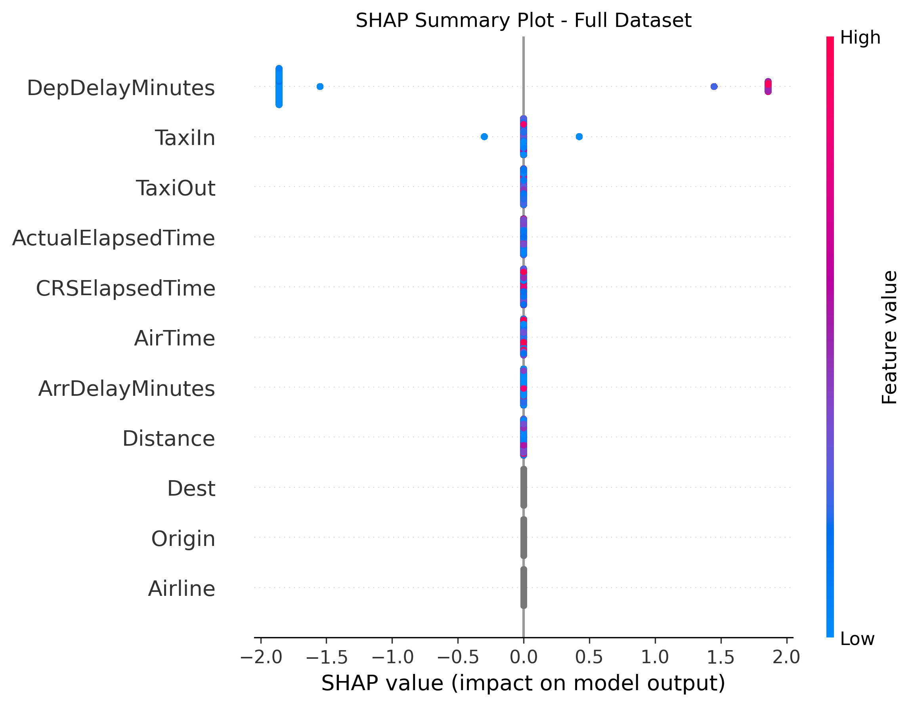

# ✈️ DelayRadar

**DelayRadar** leverages advanced machine learning and GPU-accelerated CatBoost models to accurately predict flight delays before departure, helping airlines and travelers optimize schedules and minimize disruptions. 🚀

---

## 📋 Project Overview

Flight delays cause major inconvenience and operational costs worldwide. DelayRadar uses a state-of-the-art CatBoost classifier tuned with Optuna hyperparameter optimization to predict whether a flight will be delayed, based on features available before departure.

The model was trained and evaluated on a large real-world flight dataset, achieving:

- **Accuracy:** 100% ✅ (on balanced test set)  
- **AUC (Area Under ROC Curve):** 1.0 🎯

> ⚠️ *Note:* The extremely high scores suggest the presence of data leakage via delay-related features. For realistic predictions, exclude post-departure features such as `DepDelayMinutes` and `ArrDelayMinutes`.

---

## 🗂️ Dataset

The dataset used is publicly available on Kaggle:

[Flights Delay Prediction by Ahmed Zoarob](https://www.kaggle.com/code/ahmedzoarob/flights-delay-prediction) 📥

Please download and place `flight.csv` in the project root directory.

---

## 🚀 Usage

1. **Train the model:**

```bash
python train.py
```

2. **Evaluate on the full dataset:**

```bash
python evaluate.py
```

# 📊 Results
## Confusion Matrix


## SHAP Feature Importance Bar Plot


## SHAP Feature Importance Bar Summary Plot




## Install dependencies via:
```bash
pip install -r requirements.txt
```

# 💡 Notes & Future Work

- Current model achieves near-perfect results due to leakage from delay-based features. 🚨

- Future iterations will focus on building a realistic predictive model using only pre-departure features. 🕒

- Additional data such as weather and air traffic info can improve accuracy and robustness. ☁️✈️
